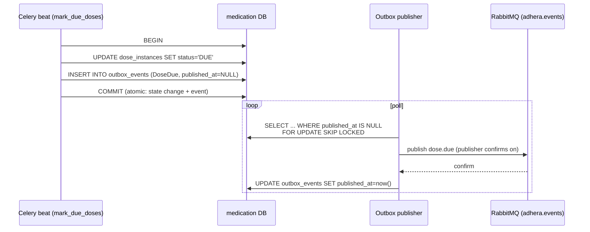
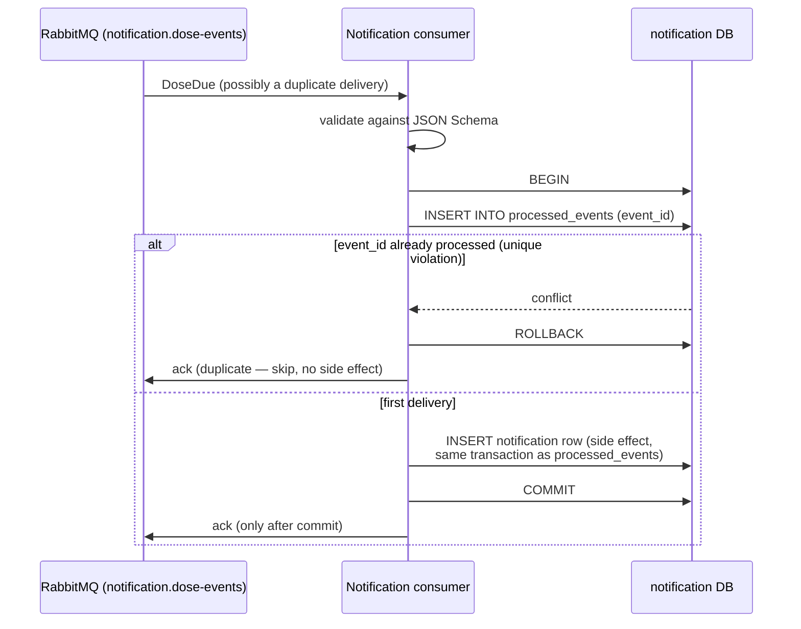
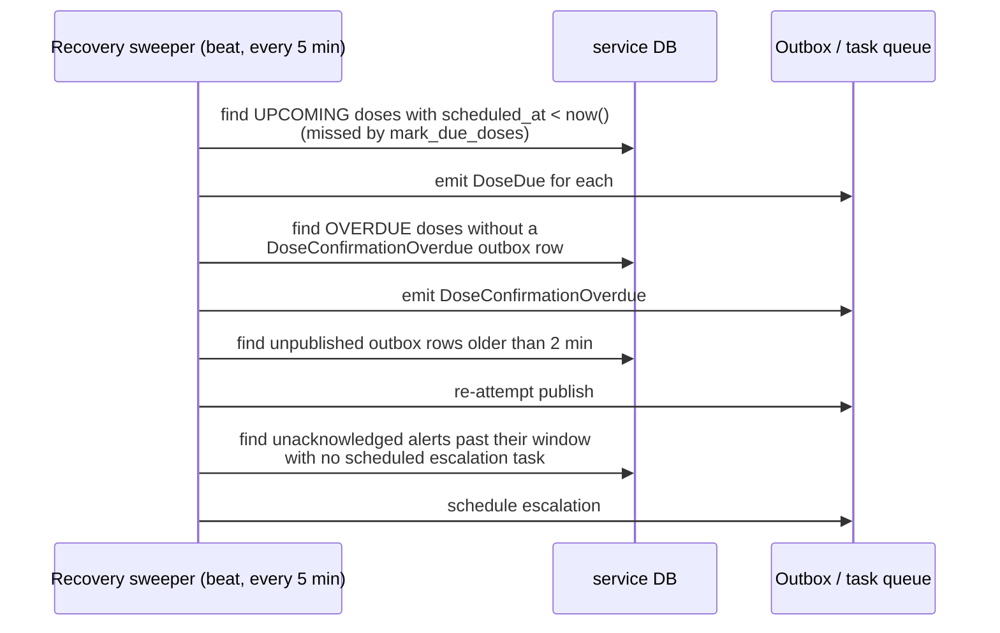

# Architecture

## Overview

Adhera is a microservices platform: an API gateway plus three backend services, communicating over REST (synchronous) and RabbitMQ events (asynchronous). Each service owns its own PostgreSQL database — no cross-service table access.

```
Angular Frontend
      |
FastAPI API Gateway  (JWT validation, routing, Redis rate limiting, correlation IDs)
      |
      +---------------------------+
      |                           |
Identity & Consent Service   Medication Service
                                  |
                              RabbitMQ
                                  |
                     Notification & Escalation Service
```

## Services

| Service | Responsibility | Port |
|---|---|---|
| api-gateway | Entry point, JWT validation, routing, rate limiting | 8000 |
| identity-service | Users, auth, caregiver relationships, granular consent, RBAC | 8001 |
| medication-service | Medications, schedules, dose generation, confirmations, time zones | 8002 |
| notification-service | Reminders, caregiver alerts, escalation, retries, alert history | 8003 |

## Event flow

1. `medication-service` generates dose instances from schedules (stored in PostgreSQL, never in-memory only).
2. When a dose is due, a `DoseDue` event is written to the **transactional outbox** in the same transaction as the dose update; a background publisher relays it to RabbitMQ.
3. `notification-service` consumes events **idempotently** (processed event IDs are stored) and sends reminders.
4. Unconfirmed doses produce `DoseConfirmationOverdue` → caregiver alert → optional secondary escalation.
5. Confirmations (`DoseConfirmed`) cancel pending reminders and escalations.

Event schemas are versioned JSON Schema documents in [`shared/event-schemas/`](../shared/event-schemas/).

## Reliability mechanisms

- **Transactional outbox** — dose updates and event publication commit atomically
- **Idempotent consumers** — duplicate RabbitMQ deliveries never create duplicate alerts
- **Recovery sweeper** — periodically finds unprocessed due doses, unescalated overdue doses, unacknowledged alerts
- **Distributed locking** — Redis / PostgreSQL advisory locks prevent double-processing
- **Retries** — exponential backoff, max attempts, dead-letter queue, delivery-attempt audit
- **Time zones** — UTC storage + per-user IANA timezone; DST transitions covered by tests

## Reliability sequences

### Transactional outbox: due detection → publish



If the process crashes between COMMIT and publish, the row still has
`published_at IS NULL` and is re-published on the next poll — delivery is
**at-least-once**, so consumers must dedupe.

### Idempotent consumer: reminder exactly once



### Recovery sweeper: nothing is lost to a crash



The database is the source of truth; Celery etas and in-flight messages are
only triggers. Anything a dead worker forgot is re-derived from persisted
state by the sweeper (implemented in Phase 4).

## Observability

- **Logs** — structlog JSON on stdout: `timestamp`, `level`, `service`, `event`,
  `correlation_id`; sensitive fields (credentials, medication free text) are
  redacted by a masking processor before rendering.
- **Correlation IDs** — every request carries `X-Correlation-ID` (generated at
  the edge if absent), bound to all log lines, echoed in responses, and
  propagated into events.
- **Metrics** — every service exposes Prometheus metrics at `/metrics`
  (HTTP latency/error defaults now; business metrics arrive in Phase 4).
- **Probes** — `/health` is liveness; `/ready` pings the service's own
  database, Redis, and RabbitMQ (where configured) and returns 503 with a
  per-dependency status map when any of them fails.

## Decisions

Architecture decision records live in [`adr/`](adr/).
